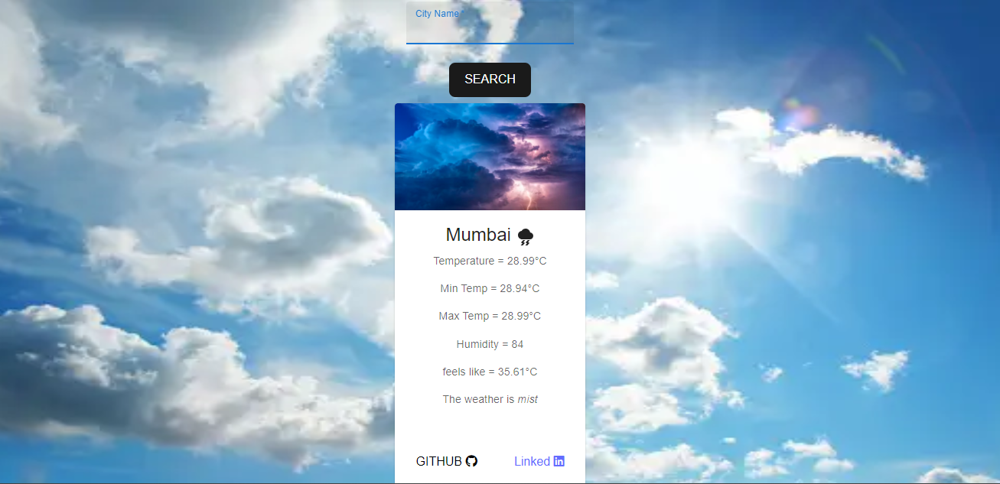

# WeatherInfo



WeatherInfo is a app .
## Live Project

Check out the live project: [WeatherInfo Live](https://weather-info-10si.onrender.com/)

## Technologies Used

- **React.js**: For building the interactive user interface.
- **Material-UI**: To create a modern and responsive design.
- **OpenWeatherMap API**: To fetch and display weather data.
- **Vite**: For a fast and efficient development build tool.
- Other awesome libraries and tools!
- 
## Key Features

- **City Search**: Search for weather information by entering the name of a city.
- **Weather Details**: Display current temperature, minimum and maximum temperatures, humidity, and weather descriptions.
- **Responsive Design**: Enjoy a sleek and adaptive interface across different devices.

## Getting Started

To run Weather App locally, follow these steps:

1. **Clone the Repository**:

    ```bash
    git clone https://github.com/vikasp07/WeatherInfo.git
    cd react-weather
    ```

2. **Install Dependencies**:

    Using npm:

    ```bash
    npm install
    ```

4. **Start the Development Server**:

    Using npm:

    ```bash
    npm run dev
    ```
    Open [http://localhost:5173](http://localhost:5173) in your browser to view the application locally.


## Contribution

Feel free to contribute to this project by opening issues or creating pull requests. Your feedback and contributions are highly appreciated!
